# Design Document

## Overview

This refactor consolidates the four current visual treatments (custom-card, custom-karaoke, reddit-card, reddit-karaoke) behind a single `CardStylePlugin` interface and decomposes the 500+ line `make_final_video` god function into focused stage modules under a new `video_creation/render/` package. The two header presentations and two body presentations stop being independent flags multiplied at runtime and become four named, registered plugins selected through a single `style` identifier in `config.toml`.

The refactor also:
- Replaces parallel `make_combined_frame` / `make_combined_mask` paths with a single RGBA frame whose alpha channel is the mask.
- Moves word→line/chunk timing into a pure-Python `TimingEngine` with no PIL/numpy/MoviePy/FFmpeg dependency.
- Switches intermediate header/body images from PNG-on-disk to in-memory `numpy.ndarray` (RGBA), with disk writes only when an explicit debug flag is set in non-production runs.
- Deletes the deprecated `render_post_card` shim from `utils/card.py` and the stand-alone `test_transition.py` script in favor of a `PreviewHarness` that calls the public render API.
- Defines a small public API (`render_video`, `available_styles`) so the harness, tests, and any future CLI use the same entry points.

The four current visual treatments must remain reproducible after the refactor (Requirement 7), but the configuration schema is allowed to change as a consequence of the cleaner architecture (Requirement 8).

### Goals

- One class per visual treatment owns header rendering, body rendering, and per-frame composition (Req 1, 4, 11).
- Pipeline stages (audio, background, timing, composition, output) are independently testable (Req 3).
- Frame and mask logic cannot drift apart (Req 4).
- Adding a fifth treatment is a single new plugin module + one decorator call (Req 1.2, 2.4, 12.2).
- Preview harness, tests, and production all enter through the same public functions (Req 10, 13).

### Non-Goals

- Changing the TTS, scraping, posttextparser, or thumbnail modules.
- Changing video resolution, fps, codec defaults, or background processing semantics (zoom, hue, eq).
- Changing the on-disk layout of `assets/temp/<id>/` or `results/<subreddit>/`.
- Changing the visual identity of any existing treatment beyond what the cleaner architecture forces (e.g., the same fonts, colors, paddings, and pop-in/zoom curves are kept).

## Architecture

### Package Layout

A new package `video_creation/render/` owns the refactor. The existing `video_creation/final_video.py` becomes a thin shim that calls into it during the migration window, then is deleted.

```
video_creation/
  __init__.py
  background.py          (untouched — TTS+post fetch+download)
  voices.py              (untouched)
  screenshot_downloader.py (untouched)
  render/
    __init__.py          # public API: render_video, available_styles
    api.py               # implements public API; thin wrapper over orchestrator
    orchestrator.py      # PipelineOrchestrator
    config.py            # RenderConfig + parsing/validation from settings.config
    context.py           # RenderContext dataclass passed to plugins
    audio/
      __init__.py
      assembler.py       # AudioAssembler
      probe.py           # ffmpeg probe wrapper (single place)
    background/
      __init__.py
      preparer.py        # BackgroundPreparer (FFmpeg scale/crop/hue/eq)
    timing/
      __init__.py
      engine.py          # TimingEngine (pure Python)
      models.py          # WordTimestamp, LineTiming, ChunkTiming dataclasses
    output/
      __init__.py
      writer.py          # OutputWriter (encode, name, thumbnail, cleanup hand-off)
      naming.py          # name_normalize moved here
    compositor/
      __init__.py
      frame.py           # FrameCompositor: RGBA frame -> MoviePy VideoClip + mask
      blend.py           # alpha-composite primitives (the _composite helper)
    styles/
      __init__.py        # StyleRegistry + @register_style decorator
      base.py            # CardStylePlugin ABC + shared helper types
      shared/
        __init__.py
        text.py          # _wrap, _text_size, _strip_emojis, _format_count
        fonts.py         # font path constants + _load_font
        avatar.py        # _download_avatar
        icons.py         # _draw_heart, _draw_bubble, _make_checkmark
        emoji_row.py     # _render_award_row, _make_french_flag
      custom_card.py     # CustomCardStyle (custom header + paginated body)
      custom_karaoke.py  # CustomKaraokeStyle (custom header + karaoke body)
      reddit_card.py     # RedditCardStyle (reddit header + paginated body)
      reddit_karaoke.py  # RedditKaraokeStyle (reddit header + karaoke body)
    preview/
      __init__.py
      harness.py         # PreviewHarness CLI entry (replaces test_transition.py)
      fake_timings.py    # synth_word_timestamps(words, wps)
```

`utils/card.py` is removed. Its shared helpers move under `video_creation/render/styles/shared/`. The four embedded subclasses (`_CustomCard`, `_RedditStyleCard`) are split into the four `CardStylePlugin` modules above, each owning its own header, body, and per-frame composition.

### High-Level Flow

```mermaid
flowchart TD
    A[main.py] --> B[render_video&#40;reddit_obj, audio_assets, config&#41;]
    B --> C[PipelineOrchestrator]
    C --> D[AudioAssembler]
    C --> E[BackgroundPreparer]
    C --> F[TimingEngine]
    C --> G[StyleRegistry.get&#40;style_id&#41;]
    G --> H[CardStylePlugin]
    H --> I[render_header&#40;ctx&#41; -> RGBA ndarray]
    H --> J[render_body&#40;ctx, line_timings&#41; -> BodyAssets]
    H --> K[compose_frame&#40;t, ctx, line_timings, body_assets, header_img&#41; -> RGBA]
    C --> L[FrameCompositor.build_clip&#40;plugin.compose_frame&#41;]
    L --> M[CompositeVideoClip&#40;background, overlay, watermark&#41;]
    C --> N[OutputWriter.write&#40;final_clip&#41;]
    N --> O[results/&lt;subreddit&gt;/&lt;name&gt;.mp4]
```



### Boundaries

- **Pure (no PIL / numpy / MoviePy / FFmpeg)**: `timing/`, `config.py`, `styles/__init__.py` (registry), `output/naming.py`.
- **PIL + numpy only**: `styles/*` plugin modules and `styles/shared/*` helpers; `compositor/blend.py`.
- **MoviePy + FFmpeg**: `audio/`, `background/`, `output/writer.py`, `compositor/frame.py` (the only place `VideoClip` is constructed).
- **Orchestration only**: `orchestrator.py` and `api.py` — no inline image manipulation, no `ffmpeg.probe` calls, no per-frame numpy operations (Req 3.6).

The orchestrator never imports PIL or numpy. Plugins never import MoviePy or FFmpeg. This keeps the per-frame composition contract tight and lets us property-test the timing engine without any image library installed.

## Components and Interfaces

### `CardStylePlugin` (styles/base.py)

The single contract every visual treatment implements. Header rendering, body rendering, and per-frame composition are co-located here (Req 1.4).

```python
# video_creation/render/styles/base.py
from __future__ import annotations
from abc import ABC, abstractmethod
from dataclasses import dataclass
from typing import Any, Mapping
import numpy as np

from video_creation.render.context import RenderContext
from video_creation.render.timing.models import LineTiming

@dataclass(frozen=True)
class BodyAssets:
    """Pre-rendered body images plus any plugin-specific per-line metadata.

    A 'paginated card' style fills `pages` with one RGBA ndarray per page.
    A 'karaoke' style fills `chunk_images` with one RGBA ndarray per chunk.
    Plugins use whichever fields they need; both may be empty.
    """
    pages: tuple[np.ndarray, ...] = ()              # paginated body pages
    chunk_images: tuple[np.ndarray, ...] = ()       # karaoke caption images
    extra: Mapping[str, Any] = None                 # plugin-private metadata

class CardStylePlugin(ABC):
    """One visual treatment: header + body + per-frame composition."""

    #: Class-level identifier; the StyleRegistry uses this as the key.
    style_id: str

    #: Declarative options this plugin accepts under [settings.style.<id>].
    #: Used by config validation and `available_styles()` reflection (Req 13.3).
    options_schema: Mapping[str, type]

    def __init__(self, options: Mapping[str, Any], canvas: "CanvasSpec") -> None:
        self.options = options
        self.canvas = canvas  # width/height/zoom from config (Req 11.3)

    # ---- Header ----------------------------------------------------------
    @abstractmethod
    def render_header(self, ctx: RenderContext) -> np.ndarray:
        """Return the static header card as an RGBA ndarray (Req 5.1)."""

    # ---- Body ------------------------------------------------------------
    @abstractmethod
    def render_body(
        self,
        ctx: RenderContext,
        line_timings: tuple[LineTiming, ...],
    ) -> BodyAssets:
        """Return body content as in-memory RGBA images (Req 5.2)."""

    # ---- Per-frame -------------------------------------------------------
    @abstractmethod
    def compose_frame(
        self,
        t: float,
        ctx: RenderContext,
        header: np.ndarray,
        body: BodyAssets,
        line_timings: tuple[LineTiming, ...],
    ) -> np.ndarray:
        """Return ONE RGBA frame for time t (Req 4.1).

        The mask MoviePy needs is derived from the alpha channel of this
        frame (Req 4.2). There is no parallel `compose_mask` (Req 4.3).
        """
```

Each of the four shipped plugins overrides all three methods and owns its own layout constants (Req 11.1) as class-level constants — no module-level constants shared across plugins (Req 11.2).

### `StyleRegistry` (styles/__init__.py)

Decorator-based registry. Adding a new plugin is one decorator call (Req 2.4).

```python
# video_creation/render/styles/__init__.py
from typing import Type
from .base import CardStylePlugin

_REGISTRY: dict[str, Type[CardStylePlugin]] = {}

def register_style(cls: Type[CardStylePlugin]) -> Type[CardStylePlugin]:
    """Decorator: register a CardStylePlugin subclass under cls.style_id."""
    if not getattr(cls, "style_id", None):
        raise TypeError(f"{cls.__name__} must define a non-empty style_id")
    if cls.style_id in _REGISTRY:
        raise ValueError(f"style_id {cls.style_id!r} already registered")
    _REGISTRY[cls.style_id] = cls
    return cls

def available_styles() -> tuple[str, ...]:
    """Return registered style identifiers (Req 2.1, 13.2)."""
    return tuple(sorted(_REGISTRY))

def get_style(style_id: str) -> Type[CardStylePlugin]:
    """Look up a plugin class by id; raise UnknownStyleError if missing (Req 2.3)."""
    try:
        return _REGISTRY[style_id]
    except KeyError:
        raise UnknownStyleError(style_id, available_styles())

class UnknownStyleError(KeyError):
    def __init__(self, requested: str, available: tuple[str, ...]) -> None:
        super().__init__(
            f"Unknown style {requested!r}. Available styles: "
            f"{', '.join(available) or '<none>'}"
        )
        self.requested = requested
        self.available = available
```

`video_creation/render/styles/__init__.py` ends with explicit imports of the four plugin modules so the decorators run on first import:

```python
from . import custom_card, custom_karaoke, reddit_card, reddit_karaoke  # noqa: F401
```

### Four Plugin Implementations (Req 7.1)

Each plugin imports only `styles.base`, `styles.shared.*`, and stdlib/PIL/numpy. No cross-plugin imports (Req 12.3).

| Module | `style_id` | Header | Body | Notes |
|---|---|---|---|---|
| `styles/custom_card.py` | `custom-card` | Clean white rounded card from current `_CustomCard` | Paginated body pages with mask-reveal scroll | Default for upgrade path. Layout constants `CARD_WIDTH_PCT`, `HEADER_Y_*`, `BODY_Y`, `POP_DUR`, `SCROLL_TIME`, `ZOOM_AMOUNT` are class-level. |
| `styles/custom_karaoke.py` | `custom-karaoke` | Same custom header | One centered caption per active chunk | Inherits header rendering helpers via `styles/shared/`, not via plugin-to-plugin inheritance (Req 12.3). |
| `styles/reddit_card.py` | `reddit-card` | Twitter/X-style card from current `_RedditStyleCard` (avatar, @handle, ✓, awards, title, ❤/💬 counts) | Paginated body pages | |
| `styles/reddit_karaoke.py` | `reddit-karaoke` | Same reddit header | Karaoke captions | |

Each plugin's `compose_frame` returns a single RGBA frame — the alpha channel doubles as the MoviePy mask (Req 4.1, 4.2). The current duplicated `make_combined_frame` / `make_combined_mask` body in `final_video.py` is replaced by one method per plugin.

The four plugins share two helper functions in `styles/shared/`:
- `composite_rgba_onto(frame, layer, x, y)` from `compositor/blend.py` — the `_composite` helper currently inlined in `test_transition.py`.
- `header_pop_zoom_scale(t, total_dur, pop_dur, zoom_amount)` — the `_pop_and_zoom` curve from `final_video.py`.

### `PipelineOrchestrator` (orchestrator.py)

Replaces `make_final_video`. Pure coordination — no image work, no ffmpeg calls, no per-frame logic (Req 3.6, 3.7).

```python
class PipelineOrchestrator:
    def __init__(
        self,
        config: RenderConfig,
        audio: AudioAssembler,
        background: BackgroundPreparer,
        timing: TimingEngine,
        compositor: FrameCompositor,
        output: OutputWriter,
    ) -> None: ...

    def render(self, reddit_obj: dict, assets: AudioAssets) -> Path:
        # 1. Validate inputs via owning modules (Req 3.7).
        audio_track, audio_durs, word_ts = self.audio.assemble(assets, self.config)
        bg_clip = self.background.prepare(reddit_obj, self.config)

        # 2. Compute timing (pure Python, Req 3.3).
        line_timings = self.timing.compute(
            words=word_ts,
            line_definitions=self._derive_line_definitions(reddit_obj),
            chunk_size=self.config.style_options.get("karaoke_words_per_chunk"),
            audio_speed=self.config.audio_speed,
            title_duration=audio_durs[0],
        )

        # 3. Build a plugin instance from the registry (Req 1.3, 3.4).
        plugin_cls = get_style(self.config.style_id)
        plugin = plugin_cls(self.config.style_options, self.config.canvas)

        ctx = RenderContext.from_reddit_obj(reddit_obj, self.config)
        header = plugin.render_header(ctx)
        body = plugin.render_body(ctx, line_timings)

        # 4. Single-source frame composition (Req 4).
        overlay_clip = self.compositor.build_clip(
            duration=line_timings.total_duration,
            make_frame=lambda t: plugin.compose_frame(t, ctx, header, body, line_timings),
        )

        # 5. Output (Req 3.5).
        return self.output.write(
            background=bg_clip,
            overlay=overlay_clip,
            audio=audio_track,
            reddit_obj=reddit_obj,
            config=self.config,
        )
```

The orchestrator imports neither PIL nor numpy nor `moviepy.VideoClip` directly — it only holds references to the stage objects.

### `FrameCompositor` (compositor/frame.py)

The only place that constructs `moviepy.VideoClip`. Takes a `make_frame: float -> np.ndarray (RGBA)` and produces a `VideoClip` whose mask is derived from the same call (Req 4.1, 4.2, 4.3).

```python
class FrameCompositor:
    def __init__(self, fps: int = 30) -> None:
        self.fps = fps

    def build_clip(self, duration: float, make_frame):
        """Build a MoviePy clip whose mask is the alpha channel of make_frame."""
        # Cache the most recent (t, frame) so the mask call doesn't re-render.
        cache: dict = {"t": None, "frame": None}

        def _frame_rgb(t):
            f = make_frame(t)
            cache["t"], cache["frame"] = t, f
            return f[:, :, :3]

        def _frame_alpha(t):
            if cache["t"] != t:
                cache["t"] = t
                cache["frame"] = make_frame(t)
            return cache["frame"][:, :, 3].astype(np.float32) / 255.0

        clip = VideoClip(_frame_rgb, duration=duration).with_fps(self.fps)
        mask = VideoClip(_frame_alpha, duration=duration, is_mask=True).with_fps(self.fps)
        return clip.with_mask(mask)
```

The cache makes the alpha-from-frame derivation cheap when MoviePy calls the RGB and mask functions back-to-back at the same `t`. There is no parallel `compose_mask` path anywhere in the codebase (Req 4.3).

### `TimingEngine` (timing/engine.py + timing/models.py)

Pure Python. No PIL, numpy, MoviePy, or FFmpeg imports (Req 6.2). This is what the property tests will hit.

```python
# timing/models.py
@dataclass(frozen=True)
class WordTimestamp:
    word: str
    start: float  # seconds, post-audio-speed
    end: float

@dataclass(frozen=True)
class LineDefinition:
    """A wrapped line of body text plus its on-image y-coordinates.
    The plugin pre-wraps body text and hands these definitions to the engine.
    """
    text: str
    word_count: int
    y_top: int
    y_bottom: int
    page_index: int

@dataclass(frozen=True)
class LineTiming:
    """Resolved timing for one line OR one chunk (chunk_size > 0)."""
    text: str
    start: float
    end: float
    line_index: int       # original line in the wrapped body
    chunk_index: int      # 0 if not chunked, else index within the line
    y_top: int
    y_bottom: int
    page_index: int

@dataclass(frozen=True)
class TimingResult:
    title_duration: float
    total_duration: float
    entries: tuple[LineTiming, ...]
```

```python
# timing/engine.py
class TimingEngine:
    def compute(
        self,
        words: tuple[WordTimestamp, ...],
        line_definitions: tuple[LineDefinition, ...],
        chunk_size: int,
        audio_speed: float,
        title_duration: float,
    ) -> TimingResult:
        """Walk the word stream, slicing it line-by-line (and optionally
        chunk-by-chunk for karaoke). Returns LineTimings whose start/end
        come straight from the word stream — no image library calls.

        Inputs are pre-scaled by audio_speed by the caller (AudioAssembler).
        """
```

The engine handles the `chunk_size > 0` case by sub-slicing each line's word window into N-word chunks (Req 7.4). When `chunk_size <= 0`, the karaoke plugin treats the line as a single chunk (Req 7.5; the config validator substitutes a documented default of `3` and emits a warning).

Plugins consult the engine's `LineTiming.start/end` to pick the active line/chunk at time `t` (Req 6.3) — they never re-derive `start/end` from word offsets.

### `AudioAssembler` (audio/assembler.py)

Owns FFmpeg probing, audio concatenation, audio-speed scaling, background-music mixing, and word-timestamp loading from the `.json` sidecar files. Returns a structured `AudioBundle`:

```python
@dataclass(frozen=True)
class AudioAssets:
    title_mp3: Path
    body_mp3s: tuple[Path, ...]                 # one per content clip
    word_timestamp_jsons: tuple[Path, ...]      # parallel to body_mp3s

@dataclass(frozen=True)
class AudioBundle:
    track: AudioFileClip                        # final mixed track
    durations: tuple[float, ...]                # post-speed durations
    word_timestamps: tuple[WordTimestamp, ...]  # post-speed timestamps
```

Handles the "missing audio" failure mode here so the orchestrator only deals with structured outputs or raised `AudioAssemblyError`s (Req 3.7).

### `BackgroundPreparer` (background/preparer.py)

Wraps the existing FFmpeg scale/crop/hue/eq invocation. Returns a `VideoFileClip` already resized to `(W, H)`. Random visual tweaks (hue ±15°, brightness ±8%, contrast ±10%, saturation ±15%) seed from `reddit_id` so reruns are deterministic for tests.

### `OutputWriter` (output/writer.py)

Owns final encoding, file naming (`name_normalize` moves here), thumbnail generation, and cleanup hand-off. Returns the final `Path`.

### `RenderConfig` (config.py)

A frozen dataclass that parses and validates `settings.config` once. Holds:
- `style_id: str`
- `style_options: Mapping[str, Any]` (scoped to the active style — see Data Models)
- `canvas: CanvasSpec` (`resolution_w`, `resolution_h`, `zoom`, `opacity`)
- `audio_speed: float`
- `theme: str`
- `debug_dump_intermediates: bool` (Req 5.4)
- `is_production: bool` (Req 5.5)

Unknown style ids raise `UnknownStyleError` here, before any rendering work begins (Req 8.4).

### `PreviewHarness` (preview/harness.py)

CLI replacement for `test_transition.py` (Req 9.2, 10).

```
python -m video_creation.render.preview \
    --style reddit-karaoke \
    --post-fixture fixtures/tifu.json \
    --timings {fake|real} \
    [--audio-dir assets/temp/<id>/mp3]   # required if --timings=real
    [--wps 3.0]                          # used only if --timings=fake
    --output preview.mp4
```

The harness:
1. Loads a fixture post.
2. Builds an `AudioAssets` either from a real `assets/temp/<id>/mp3/` directory or a synthesized silent track + fake `WordTimestamp`s from `fake_timings.synth_word_timestamps`.
3. Calls the public `render_video(...)` (Req 10.1).

It does **not** re-implement frame composition, header/body rendering, or timing (Req 10.2). When `--timings=real`, real `WordTimestamp`s flow through the same `TimingEngine` (Req 10.5). When `--timings=fake`, only the input layer differs; the engine, plugin, and compositor are the production code paths (Req 10.4).

### Public API (api.py + render/__init__.py)

```python
# video_creation/render/__init__.py
from .api import render_video, available_styles, plugin_options_schema
__all__ = ["render_video", "available_styles", "plugin_options_schema"]
```

```python
# video_creation/render/api.py
def render_video(
    style_id: str,
    reddit_obj: dict,
    audio: AudioAssets,
    config_overrides: Mapping[str, Any] | None = None,
) -> Path:
    """Public entry point (Req 13.1). Returns path to the rendered MP4."""

def available_styles() -> tuple[str, ...]:
    """Return registered style identifiers (Req 13.2)."""

def plugin_options_schema(style_id: str) -> Mapping[str, type]:
    """Return the options a plugin accepts (Req 13.3)."""
```

`main.py` (and the existing `final_video.make_final_video` shim, during migration) calls only these three functions.

## Data Models

### Configuration Schema (Req 8)

The current flat keys (`card_style`, `body_style`, `dismiss_title_on_body`, `karaoke_words_per_chunk`, `theme`) collapse into a single `style` identifier plus a per-style scoped section.

```toml
# config.toml — new shape
[settings]
allow_nsfw = false
times_to_run = 1
opacity = 1.0
storymode = true
storymodemethod = 1
storymode_max_length = 1000
resolution_w = 1080
resolution_h = 1920
zoom = 1.0
channel_name = "Casual Conversation"

# A single identifier picks one CardStylePlugin (Req 8.1).
# Available: custom-card, custom-karaoke, reddit-card, reddit-karaoke.
style = "reddit-karaoke"

# Per-style options — only the section matching `style` is consulted.
# Unknown keys here are warned about; missing keys fall back to plugin defaults.
[settings.style.custom-card]
theme = "light"                  # light | dark
dismiss_title_on_body = false

[settings.style.custom-karaoke]
theme = "light"
karaoke_words_per_chunk = 3      # must be >= 1 (Req 7.5)

[settings.style.reddit-card]
theme = "light"
dismiss_title_on_body = false

[settings.style.reddit-karaoke]
theme = "light"
karaoke_words_per_chunk = 3
dismiss_title_on_body = true
```

Each plugin declares its `options_schema` so `RenderConfig` can validate the `[settings.style.<id>]` section without hard-coding the option names in the orchestrator (Req 8.2, 13.3). `plugin_options_schema(style_id)` is the documented surface for tooling.

`config.toml` ships with comments describing each setting (Req 8.5).

### `RenderContext`

Frozen dataclass passed into every plugin call. Plugins read from this; they never reach back into `settings.config`.

```python
@dataclass(frozen=True)
class RenderContext:
    title: str
    body_text: str
    author: str
    avatar_url: str
    subreddit: str
    upvotes: int
    num_comments: int
    canvas: CanvasSpec
    theme: str  # plugins may ignore this if they don't support themes (Req 7.3)
```

### `LineDefinition` / `LineTiming` / `TimingResult`

See the `TimingEngine` section above — these are the timing engine's I/O types and live in `timing/models.py`.

### `BodyAssets`

See `CardStylePlugin` above. RGBA `numpy.ndarray`s replace the current `(header_path, body_pages)` of file paths (Req 5.1, 5.2).

### Debug Intermediate Dump Layout (Req 5.4)

When `RenderConfig.debug_dump_intermediates` is true **and** `RenderConfig.is_production` is false:

```
assets/temp/<reddit_id>/debug/
  header.png
  body_page_000.png
  body_page_001.png
  ...
  chunk_000.png         # karaoke only
  ...
```

In production runs, no intermediate PNGs are written regardless of the flag (Req 5.5). Final outputs (final video, thumbnail) keep their current paths (Req 5.6).

<!-- Correctness Properties section continues after prework. -->

## Correctness Properties

*A property is a characteristic or behavior that should hold true across all valid executions of a system — essentially, a formal statement about what the system should do. Properties serve as the bridge between human-readable specifications and machine-verifiable correctness guarantees.*

The properties below were derived from the prework analysis and consolidated to remove redundancy. Each property tests YOUR code's logic (registry dispatch, timing math, frame contracts, plugin independence) and benefits from running 100+ iterations across generated inputs.

Items classified as SMOKE in the prework (architectural / static checks) and INTEGRATION (end-to-end pipeline runs with mocks) are covered by the Testing Strategy section below, not as universal properties.

### Property 1: Registry round-trip dispatch

*For any* registered `style_id` and *any* options conforming to the plugin's `options_schema`, calling `render_video(style_id=id, ..., config=opts)` SHALL instantiate the class returned by `get_style(id)` with those options and use it to produce the per-frame composition.

**Validates: Requirements 1.2, 2.1, 2.2, 2.4, 8.1, 8.3, 13.1**

### Property 2: Unknown style identifier error

*For any* string `s` that is not in `available_styles()`, looking up `s` (via `get_style(s)` or via `RenderConfig.from_settings({"style": s, ...})`) SHALL raise `UnknownStyleError` whose message contains the literal string `s` and every currently-registered style identifier.

**Validates: Requirements 2.3, 8.4**

### Property 3: Frame is RGBA with canvas dimensions

*For any* registered plugin, *any* `RenderContext` with canvas `(W, H)`, and *any* `t` in `[0, total_duration]`, `plugin.compose_frame(t, ctx, header, body, line_timings)` SHALL return a `numpy.ndarray` of shape `(H, W, 4)` and dtype `uint8`.

**Validates: Requirements 4.1, 11.3**

### Property 4: Mask equals frame alpha at every timestamp

*For any* `make_frame: float -> ndarray(H, W, 4)` and *any* timestamp `t`, the `VideoClip` produced by `FrameCompositor.build_clip(make_frame).mask.get_frame(t)` SHALL equal `make_frame(t)[:, :, 3].astype(float32) / 255.0` element-wise.

**Validates: Requirements 4.2**

### Property 5: Plugin renderers return in-memory RGBA

*For any* registered plugin and *any* valid `RenderContext`, `plugin.render_header(ctx)` SHALL return a `numpy.ndarray` (not a file path), and `plugin.render_body(ctx, line_timings)` SHALL return a `BodyAssets` whose `pages` and `chunk_images` entries are all `numpy.ndarray` of shape `(_, _, 4)`.

**Validates: Requirements 5.1, 5.2**

### Property 6: Non-debug runs write no intermediate images

*For any* run where `RenderConfig.debug_dump_intermediates` is False *or* `RenderConfig.is_production` is True, the rendering pipeline SHALL NOT create any file under `assets/temp/<reddit_id>/debug/`.

**Validates: Requirements 5.3, 5.5**

### Property 7: Debug-enabled non-production runs write expected intermediates

*For any* registered plugin and *any* run where `debug_dump_intermediates` is True *and* `is_production` is False, the rendering pipeline SHALL write `header.png` and at least one body asset (a `body_page_*.png` for paginated styles or a `chunk_*.png` for karaoke styles) under `assets/temp/<reddit_id>/debug/`.

**Validates: Requirements 5.4**

### Property 8: TimingEngine output is well-formed and deterministic

*For any* sequence of word timestamps `words` (with monotonically non-decreasing start times and `start <= end` per word) and *any* sequence of line definitions whose total `word_count` equals `len(words)`, `TimingEngine.compute(...)` SHALL return a `TimingResult` such that:
- entries are ordered by `start` (each entry's `start <= next entry's start`),
- each entry's `start <= end`,
- the multiset of words consumed across all entries equals the input `words`,
- calling `compute` twice with the same inputs returns equal `TimingResult`s.

**Validates: Requirements 6.1**

### Property 9: Karaoke chunking splits lines by chunk_size

*For any* line definition with `n` words and *any* `chunk_size = k > 0`, `TimingEngine.compute` SHALL emit exactly `ceil(n / k)` `LineTiming` entries for that line whose `text.split()` lengths sum to `n` and whose first `floor(n / k)` entries each have exactly `k` words.

**Validates: Requirements 7.4**

### Property 10: Invalid chunk_size is replaced by the documented default

*For any* `chunk_size <= 0` in the parsed `[settings.style.<id>]` block of a karaoke-supporting plugin, the resulting `RenderConfig.style_options["karaoke_words_per_chunk"]` SHALL equal the documented default `3`, and a `ConfigWarning` SHALL be emitted.

**Validates: Requirements 7.5**

### Property 11: Theme setting changes header pixels for theme-aware plugins

*For any* theme-aware plugin and *any* `RenderContext` differing only in `theme` (`"light"` vs `"dark"`), the central card-background pixel of `plugin.render_header(ctx)` SHALL differ between the two renders.

**Validates: Requirements 7.3**

### Property 12: Header dismiss zeroes header alpha after dismiss_dur

*For any* dismiss-supporting plugin, *any* `RenderContext`, and *any* `t > title_duration + plugin.HEADER_DISMISS_DUR`, the alpha channel of `plugin.compose_frame(t, ...)` in the header's display region SHALL be `0` when the plugin's options have `dismiss_title_on_body=True`, and SHALL be nonzero in the same region when `dismiss_title_on_body=False`.

**Validates: Requirements 7.6**

### Property 13: Per-style options scoping round-trip

*For any* registered `style_id` and *any* mapping `opts` matching that plugin's `options_schema`, building `RenderConfig` from a `[settings]` block with `style = "<id>"` and `[settings.style.<id>] = opts` SHALL produce `RenderConfig.style_options == opts`, regardless of values present under sibling `[settings.style.<other_id>]` blocks.

**Validates: Requirements 8.2**

### Property 14: Plugin independence under monkeypatching

*For any* pair of distinct registered plugins `(P_target, P_other)`, replacing `P_target.compose_frame` with a stub that returns a constant frame SHALL NOT change the byte-output of `render_video(style_id=P_other.style_id, ...)` compared to a baseline run with no monkeypatch (using the same fixed seed for `BackgroundPreparer`).

**Validates: Requirements 12.1**

### Property 15: Options schema reflection

*For any* registered `style_id`, `plugin_options_schema(style_id)` SHALL return a non-empty `Mapping[str, type]` equal to `get_style(style_id).options_schema`.

**Validates: Requirements 13.3**

### Property 16: Fake-timing synthesizer math

*For any* non-empty list of words and *any* `wps > 0`, `synth_word_timestamps(words, wps)` SHALL return a tuple of `WordTimestamp`s of length `len(words)` such that each consecutive pair satisfies `next.start == prev.end` (contiguous), each timestamp satisfies `end - start == 1.0 / wps`, and the total span equals `len(words) / wps`.

**Validates: Requirements 10.4**

### Property 17: Preview harness dispatches to the requested plugin

*For any* registered `style_id`, invoking `PreviewHarness.run(--style style_id, ...)` with a fixture SHALL produce a non-zero MP4 at the requested output path, and the plugin returned by `get_style(style_id)` SHALL receive at least one `compose_frame` call during the run.

**Validates: Requirements 10.3**

## Error Handling

The refactor introduces a small hierarchy of structured errors so callers (the orchestrator, the harness, `main.py`) can distinguish failure modes without parsing log strings.

```python
# video_creation/render/errors.py
class RenderError(Exception):
    """Base class for all rendering pipeline errors."""

class UnknownStyleError(RenderError, KeyError):
    """Raised by StyleRegistry / RenderConfig for unregistered style_id (Req 2.3, 8.4)."""

class ConfigError(RenderError, ValueError):
    """Raised by RenderConfig for malformed [settings.style.<id>] options."""

class ConfigWarning(UserWarning):
    """Emitted when a value is silently coerced (e.g., chunk_size <= 0 -> 3) (Req 7.5)."""

class AudioAssemblyError(RenderError):
    """Raised by AudioAssembler when an mp3 / word JSON is missing or unprobable (Req 3.7)."""

class BackgroundPreparationError(RenderError):
    """Raised by BackgroundPreparer when FFmpeg fails."""

class OutputWriteError(RenderError):
    """Raised by OutputWriter when the final encode fails."""
```

Per-stage error policy:

| Stage | On error | Surface |
|---|---|---|
| `RenderConfig.from_settings` | Raise `ConfigError` / `UnknownStyleError` before any rendering work | Caught by `main.py`, logged via `print_step` |
| `AudioAssembler.assemble` | Raise `AudioAssemblyError` (Req 3.7); orchestrator never inspects raw `ffmpeg.probe` exceptions | Propagates out of `render_video` |
| `BackgroundPreparer.prepare` | Raise `BackgroundPreparationError` with the `ffmpeg.Error.stderr` decoded | Propagates |
| `TimingEngine.compute` | Raise `ValueError` for inconsistent inputs (e.g., line `word_count` sum != `len(words)`); never silently truncate | Propagates |
| `CardStylePlugin.compose_frame` | Plugins must return a valid frame for any `t` in `[0, total_duration]`; out-of-range `t` returns a transparent `(H, W, 4)` zero-frame | No exception path during MoviePy rendering |
| `OutputWriter.write` | Raise `OutputWriteError` on encode failure; cleanup-on-failure deletes the partially-written `.mp4` | Propagates |

Coercion behavior (warnings, not errors):
- `karaoke_words_per_chunk <= 0` → `3` with `ConfigWarning` (Req 7.5).
- Unknown keys inside `[settings.style.<id>]` → ignored with `ConfigWarning`.
- Missing optional fields (`theme`, `dismiss_title_on_body`) → plugin defaults with no warning.

The orchestrator does no input validation of its own (Req 3.7); it consumes structured outputs from each stage or surfaces raised errors.

## Testing Strategy

The pipeline is tested at three layers, matching the prework classifications.

### Layer 1: Property-based tests (PBT applies)

PBT applies to this feature because the registry, timing engine, frame compositor, and plugin contracts are pure functions over structured inputs with universal invariants. The seventeen properties above are each implemented as a single property-based test in `tests/render/test_properties.py` using **Hypothesis** (the standard Python PBT library).

Configuration:
- Each property test runs ≥ 100 iterations (Hypothesis `settings(max_examples=100)`).
- Each test is tagged with a comment of the form `# Feature: card-rendering-refactor, Property N: <text>` referencing the design property.
- Hypothesis profiles: `dev` (50 examples, fast), `ci` (200 examples, default in CI).
- Generators live in `tests/render/strategies.py`:
  - `word_timestamps()` — monotonically non-decreasing word streams.
  - `line_definitions()` — line definitions whose `word_count` sum matches a given word stream.
  - `render_contexts()` — random titles/bodies/authors with constrained character sets so font measurement stays reasonable.
  - `canvas_specs()` — `(W, H)` from a small grid (480×854, 720×1280, 1080×1920, 1440×2560) plus a random sample.
  - `style_ids()` — `sampled_from(available_styles())`.
  - `fake_plugin_class()` — generates trivial `CardStylePlugin` subclasses with random `style_id`s for registry-round-trip tests, with a registry-reset fixture.

The frame-shape and mask-derivation properties (P3, P4) cap iterations at 30 because each call invokes PIL/numpy; the timing-engine and registry properties (P1, P2, P8, P9, P10, P15, P16) run the full 100+.

### Layer 2: Integration tests

Cover SMOKE / INTEGRATION items from the prework with concrete fixtures.

- `tests/render/test_orchestrator_delegation.py` — for each of audio / background / timing / compositor / output, replace the stage with a spy; assert it receives the right inputs and that the orchestrator never imports PIL or numpy (validates 3.1–3.5, 3.7).
- `tests/render/test_styles_smoke.py` — render a 1-second MP4 for each of the four `style_id`s on a tiny fixture (`fixtures/short_post.json` with two lines of body text) and assert the file exists and has nonzero size (validates 7.2, 13.1).
- `tests/render/test_preview_harness.py` — run `python -m video_creation.render.preview --style <id> --post-fixture fixtures/short_post.json --timings fake --output <tmp>/preview.mp4` for each `<id>`; assert the MP4 exists. A second invocation with `--timings real` against a pre-recorded mp3+json fixture asserts `synth_word_timestamps` was not called (validates 10.5).
- `tests/render/test_static_layout.py` — AST-based assertions:
  - `orchestrator.py` does not import `PIL`, `numpy`, `ffmpeg`, or `moviepy.VideoClip` (Req 3.6).
  - `timing/` does not import `PIL`, `numpy`, `moviepy`, or `ffmpeg` (Req 6.2).
  - `styles/<plugin>.py` does not import from another `styles/<plugin>.py` module (Req 12.3).
  - No `if style ==` / `if card_style ==` / `if body_style ==` outside `styles/` (Req 1.3).
  - `is_mask=True` appears exactly once in `compositor/frame.py` and nowhere else (Req 4.3).
  - `from utils.card import render_post_card` raises `ImportError` (Req 9.1); `Path("test_transition.py").exists()` is False (Req 9.2).
  - Each registered plugin's `cls.__module__` starts with `video_creation.render.styles.` (Req 12.2).
  - `available_styles() == ('custom-card', 'custom-karaoke', 'reddit-card', 'reddit-karaoke')` (Req 7.1, 13.2).

### Layer 3: Visual regression (manual, low-frequency)

Run the preview harness on a fixed fixture for each of the four styles, write the MP4s to `tests/render/snapshots/`, and review by eye after any plugin-internal change. No automated pixel comparison — these are reference videos a maintainer compares manually before merging visual changes.

PBT does NOT apply to:
- The actual MP4 encode (handled by FFmpeg/MoviePy — vendor code).
- The `BackgroundPreparer`'s FFmpeg filter chain (deterministic external transformation).
- `OutputWriter` filename normalization (small input space — covered by example tests).
- Visual identity of headers (handled by visual regression).

## Migration Plan

The refactor lands in five phases. Each phase leaves the build green and the existing `make_final_video` behavior unchanged until the last phase.

### Phase 1 — Carve out `video_creation/render/` skeleton (no behavior change)

1. Create the package layout described in Architecture, with empty placeholder modules.
2. Move pure helpers (`name_normalize`, `_strip_emojis`, `_render_caption_image`, `_render_karaoke_line`, `_pop_and_zoom`, `_apply_zoom`) into the new locations under `compositor/`, `output/naming.py`, and `styles/shared/`.
3. Re-import them in `final_video.py` so `make_final_video` is unchanged.
4. Add the `errors.py` hierarchy.

### Phase 2 — Extract pure-Python `TimingEngine`

1. Lift the word→line/chunk timing block from `make_final_video` (lines that build `line_timings` from `all_word_timestamps`) into `timing/engine.py`.
2. Define `WordTimestamp`, `LineDefinition`, `LineTiming`, `TimingResult`.
3. Replace the inlined block in `make_final_video` with a call into the engine.
4. Land the property tests for P8 and P9 (timing well-formedness, chunking math) — these have no PIL/numpy dependency so they can run before the rest of the refactor.

### Phase 3 — Introduce `CardStylePlugin` + four plugins (running side-by-side with old code)

1. Add `styles/base.py`, `styles/__init__.py` (registry), and the four plugin modules.
2. Each plugin's `render_header` / `render_body` is a thin wrapper that calls into the existing `utils/card.py` `_CustomCard` / `_RedditStyleCard` classes and returns `numpy.array(Image.open(...))` for the resulting paths — preserving identical output.
3. Each plugin's `compose_frame` is initially the existing `make_combined_frame` body, parameterized by which header style and which body style it owns.
4. Add `RenderConfig.from_settings`. While the new `style` key is missing, `RenderConfig` falls back to the legacy `card_style` + `body_style` flat keys and maps them to one of the four `style_id`s (compatibility shim for one release).
5. Add the registry round-trip property tests (P1, P2, P15) and the frame-shape / RGBA properties (P3, P5).

### Phase 4 — Switch `make_final_video` to call into the new pipeline

1. Replace the body of `video_creation/final_video.py:make_final_video` with a call to `video_creation.render.api.render_video`.
2. Inline the `make_combined_frame` / `make_combined_mask` pair is removed: `compositor/frame.py:FrameCompositor.build_clip` derives mask from frame alpha (Property 4 begins to hold).
3. The four plugins' `render_header` / `render_body` are rewritten to produce RGBA `numpy.ndarray`s natively, no longer round-tripping through PNG paths (Property 5 begins to hold).
4. Add `is_production` flag (default True from `main.py`, False from tests/harness) and the debug-dump path under `assets/temp/<id>/debug/` (Properties 6 and 7).
5. Add layout-constant ownership: each plugin's class-level constants replace the module-level constants in `final_video.py` (Req 11.1, 11.2). `resolution_w/h/zoom/opacity` flow only through `RenderContext.canvas` (Req 11.3).
6. Run all integration tests (Layer 2) and confirm the four-style smoke test passes.

### Phase 5 — Remove deprecated surfaces and ship the new harness

1. Delete `video_creation/final_video.py` (replaced by `render/api.py`); update `main.py` to import `render_video` directly.
2. Delete `utils/card.py` entirely. Remove `render_post_card` (Req 9.1).
3. Delete `test_transition.py` from the repo root (Req 9.2).
4. Remove the legacy flat-key fallback from `RenderConfig` (the compatibility shim added in Phase 3); from this commit forward, `config.toml` MUST use the new `style = "..."` schema (Req 8.1, 8.4).
5. Update `config.toml` to the new schema with documentation comments (Req 8.5).
6. Add `video_creation/render/preview/harness.py` and document `python -m video_creation.render.preview --help`.
7. Final layout-static tests (Req 1.3, 3.6, 4.3, 6.2, 9.1, 9.2, 11.1, 11.2, 12.2, 12.3) flip from xfail to passing.

### Migration Risks and Mitigations

- **Visual drift between old and new pipelines**: mitigated by Phase 3 keeping plugins as thin wrappers around the existing `_CustomCard`/`_RedditStyleCard` classes; visual changes only land in Phase 4 when intermediate PNGs become RGBA arrays. A maintainer eyeball-compares one MP4 per style at each phase boundary.
- **Per-frame perf regression from `FrameCompositor` calling `make_frame` twice (once for RGB, once for mask)**: mitigated by the 1-entry frame cache keyed on `t` in `compositor/frame.py:FrameCompositor.build_clip`.
- **Config compatibility break**: mitigated by Phase 3's fallback to `card_style + body_style → style_id`. The break is announced for one release before Phase 5 removes the fallback.
- **`utils/card.py` is imported elsewhere**: a grep before Phase 5 confirms only `video_creation/final_video.py` and `test_transition.py` import it; both are deleted in Phase 5.
