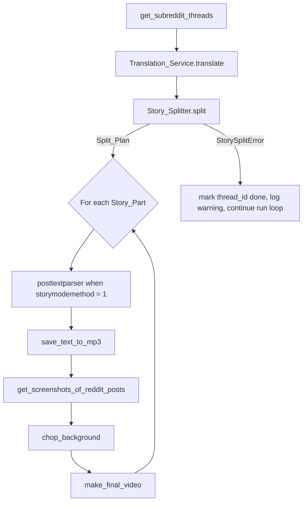

# Design Document: Story Multi-Part Splitting

## Overview

This feature adds a new pipeline stage, `Story_Splitter`, that converts a translated `Reddit_Content` whose `thread_post` exceeds a configured target length into a `Split_Plan` of one or more `Story_Part` dictionaries. The orchestrator (`main.py::main` and `batch.py::make_one_video`) then iterates the consumer stages (`posttextparser`, `save_text_to_mp3`, `get_screenshots_of_reddit_posts`, `chop_background`, `make_final_video`) once per `Story_Part`, producing a separate video file per part with `-pN` suffixed thread IDs.

The design is constrained by three goals:

1. **Surgical placement.** The splitter slots between `Translation_Service.translate` and `posttextparser`/`save_text_to_mp3` in `main.py::main`. It does not modify any file in the `claude-translation` spec's scope (`utils/translation/*`, the translation invocation in `main.py`).
2. **Backwards compatibility.** When `config.toml` contains no `[splitting]` section and no per-subreddit overrides, the resolved mode is `cutoff` and all observable artifacts (filenames, `assets/temp/{id}/` layout, `videos.json` records) are byte-for-byte identical to the pre-feature pipeline.
3. **Correctness pinned by property tests.** Reconstruction, character conservation, length invariants, determinism, and decoration round-trip are all expressed as universally quantified properties (Requirement 9) and run with at least 100 iterations.

The splitter is a pure function of `(Reddit_Content, Splitting_Config) -> Split_Plan`; it does no I/O, makes no network calls, and never mutates its input.

### Open questions resolved by this design

The requirements document lists three open questions. This design resolves them as follows:

1. **Subreddit name resolution for multi-subreddit queries (Q1).** Choice: **(a) extend `_RedditPost` to carry the subreddit name** scraped from each submission's `data["subreddit"]` field, and propagate that name into `Reddit_Content["subreddit_name"]`. The Reddit JSON response always includes a `subreddit` field for every submission, so this requires only a one-line addition to `_RedditPost.__init__` and one new key in the dict assembled by `get_subreddit_threads` and `batch.build_reddit_object`. The fallback (when `subreddit_name` is missing or empty) is the first segment of the configured `[reddit.thread] subreddit` value, split on `+`. This change touches `reddit/subreddit.py` only at the level of adding fields, which is allowed under Requirement 13.2.

2. **Interaction with `posttextparser` when `storymodemethod = 1` (Q2).** Choice: **(b) split raw text first, then run `posttextparser` per part**. Rationale: the splitter already prefers paragraph and sentence boundaries (Requirement 4), so a split that crosses a sentence is rare; running `posttextparser` per part keeps each part's sentence list aligned with its own video output and avoids the bookkeeping cost of mapping a global sentence index back to a part offset. The orchestrator runs `posttextparser` inside the `Per_Part_Loop`, after the splitter and before `save_text_to_mp3`.

3. **Per-part NSFW / blocked-words re-checks (Q3).** Choice: **no per-part re-filtering**. The post as a whole was already accepted by the scrape-time filters in `utils/subreddit.py::get_subreddit_undone`. The splitter does not introduce new text — every `part_raw_post` is a verbatim slice of the input `thread_post` — so no banned phrase can appear in a part that did not appear in the whole. The decorated body (`part_thread_post`) adds operator-controlled template text only; operators are responsible for not configuring banned words into their own templates.

## Architecture

### High-level flow



### Module layout

```
utils/story_splitter/
    __init__.py            — public API: Story_Splitter, Split_Plan, Story_Part, StorySplitError, SplittingConfig
    types.py               — TypedDicts for Story_Part, Split_Plan; dataclass for SplittingConfig
    config.py              — SplittingConfig.from_settings(settings_config, subreddit_name)
    boundaries.py          — boundary_search and boundary classification helpers (pure)
    splitter.py            — Story_Splitter.split(reddit_content) and the iterative split algorithm
    templates.py           — apply_templates(plan, config) — title/body decoration
    errors.py              — StorySplitError
```

Why a new top-level package: the splitter is more than one short module (boundary search, redistribution, templating, config) and has its own configuration surface that mirrors `utils/translation/` (also a package). This keeps `utils/` flat — every spec-scale subsystem gets its own subpackage rather than being scattered across `utils/*.py` files.

### Files modified by this feature

| File | Change |
|------|--------|
| `utils/story_splitter/*` | New package (created by this spec). |
| `utils/subreddit.py::get_subreddit_undone` | Replace the hard `len(selftext) > storymode_max_length` filter with a per-subreddit length ceiling: `Hard_Max_Length` for `cutoff` mode, `Max_Parts × Hard_Max_Length` for `split` mode. The mode and ceilings are computed by `SplittingConfig.from_settings(settings.config, subreddit_name)`. |
| `reddit/subreddit.py::_RedditPost.__init__` | Add `self.subreddit = data.get("subreddit", "")`. Set `content["subreddit_name"]` in `get_subreddit_threads`. |
| `batch.py::build_reddit_object` | Set `content["subreddit_name"]` from `submission.subreddit`. Replace the `storymode_max_length` cutoff in `is_valid_post` with the same per-subreddit ceiling used by `get_subreddit_undone`. |
| `main.py::main` | Insert `Story_Splitter.split` after `Translation_Service.translate`. Wrap the consumer stages in a `for story_part in split_plan` loop. Catch `StorySplitError` and write a "skipped" record to `videos.json`. |
| `batch.py::make_one_video` | Identical orchestration change as `main.py::main`, minus the `make_one_video` exit-on-exception behavior. |
| `config.toml` and `config.toml.sample` | Add `[splitting]`, `[splitting.templates]` sections with documented defaults. Leave `[settings] storymode_max_length` in place for backwards compatibility. |
| `utils/.config.template.toml` | Document every new field per Requirement 10.4. |

The `[reddit.thread]` section, the `Translation_Service` call site, the consumer-stage modules (`save_text_to_mp3`, screenshot pipeline, `chop_background`, `make_final_video`), and `utils/translation/*` are **not** modified.

### Public API

```python
# utils/story_splitter/__init__.py
from utils.story_splitter.errors import StorySplitError
from utils.story_splitter.types import Story_Part, Split_Plan, SplittingConfig
from utils.story_splitter.splitter import Story_Splitter

__all__ = ["Story_Splitter", "Story_Part", "Split_Plan", "SplittingConfig", "StorySplitError"]
```

```python
class Story_Splitter:
    def __init__(self, config: SplittingConfig) -> None: ...
    def split(self, reddit_content: dict) -> list[Story_Part]: ...
        # Returns a Split_Plan (= list[Story_Part]) of length >= 1.
        # Raises StorySplitError on failure (Requirement 8.1).
        # Never mutates reddit_content.
```

`SplittingConfig` is constructed at the orchestrator from the resolved subreddit name:

```python
config = SplittingConfig.from_settings(
    settings.config,
    subreddit_name=reddit_object.get("subreddit_name", ""),
)
splitter = Story_Splitter(config)
split_plan = splitter.split(reddit_object)
```

The orchestrator owns the iteration; `Story_Splitter` is a pure-data transformation.

## Components and Interfaces

### `SplittingConfig` (frozen dataclass)

```python
from dataclasses import dataclass, field
from typing import Literal, Mapping

SplitMode = Literal["cutoff", "split"]

@dataclass(frozen=True)
class TemplateConfig:
    title_first_part: str
    title_other_part: str
    body_prefix_other_part: str
    body_suffix_non_final_part: str

@dataclass(frozen=True)
class SplittingConfig:
    mode: SplitMode
    soft_max_length: int
    single_part_tolerance: float       # >= 1.0 (clamped)
    min_part_length: int               # >= 1
    max_parts: int                     # >= 1
    templates: TemplateConfig
    subreddit_name: str                # resolved name, lowercased; empty string allowed

    @property
    def hard_max_length(self) -> int:
        return int(self.soft_max_length * self.single_part_tolerance)
```

**Resolution order in `SplittingConfig.from_settings(settings_config, subreddit_name)`:**

1. Read top-level `[splitting]` defaults: `default_mode`, `soft_max_length`, `single_part_tolerance`, `min_part_length`, `max_parts`.
2. If `[splitting] soft_max_length` is absent and `[settings] storymode_max_length` is present, use the latter as the effective `soft_max_length` (Req 10.5).
3. If `subreddit_name` is non-empty, look up `[splitting.subreddits.<lower(subreddit_name)>]` and override any of the five fields present in that table. The `mode` field of that table maps to the per-post `Split_Mode`; if absent, the resolved mode is `default_mode`.
4. Read `[splitting.templates]` with defaults from Requirement 6.1.
5. Validation:
   - `default_mode` not in `{"cutoff", "split"}` → log error, fall back to `"cutoff"` for the run (Req 2.8). Per-subreddit `mode` overrides invalid values are treated identically.
   - `single_part_tolerance < 1.0` → log warning, clamp to `1.0` (Req 3.6).
   - Effective `soft_max_length < 1` → log warning, fall back to `1000` (Req 10.6).
   - `min_part_length < 1` → log warning, clamp to `1`.
   - `max_parts < 1` → log warning, clamp to `1`.

The function never raises on bad config — it logs and degrades, matching the "log + continue" pattern already used by `utils/translation/config.py`.

### `Story_Splitter.split` algorithm

The splitter operates entirely on `thread_post: str` and produces a list of `Story_Part`s. Subreddit lookup, mode resolution, and length-cutoff decisions are pre-baked into `SplittingConfig`.

#### Step 1: Single-part short-circuits (Req 3.3, 1.7, 9.6)

```
if not reddit_content.get("storymode", settings.config["settings"]["storymode"]):
    return [_single_part(reddit_content)]   # Req 1.7

post = reddit_content["thread_post"]
if config.mode == "cutoff":
    return [_single_part(reddit_content)]   # Req 2.4 (cutoff is always single-part at splitter time)

if len(post) <= config.hard_max_length:
    return [_single_part(reddit_content)]   # Req 3.3, 9.6
```

`_single_part(reddit_content)` builds a `Story_Part` with `part_number=1`, `total_parts=1`, `part_raw_post = thread_post`, `part_thread_post = thread_post`, `part_thread_title = thread_title`, and `part_thread_id = thread_id` (no suffix; Req 6.6, 7.6, 9.6).

#### Step 2: Iterative greedy split with redistribution (Req 4, 5)

Pseudocode for the splitting algorithm:

```python
def _split_iterative(post: str, config: SplittingConfig) -> list[tuple[int, int, str]]:
    """
    Returns a list of (start_offset, end_offset, boundary_type) tuples
    naming the slice of `post` for each part.
    boundary_type is one of "paragraph", "sentence", "line", "whitespace".
    The last element's end_offset is len(post) and its boundary_type is "end".
    """
    parts: list[tuple[int, int, str]] = []
    cursor = 0
    while cursor < len(post):
        remaining = post[cursor:]

        # Single remaining part fits the hard ceiling
        if len(remaining) <= config.hard_max_length:
            parts.append((cursor, len(post), "end"))
            break

        # Search for the boundary closest to soft_max_length from below,
        # within [Min_Part_Length, Hard_Max_Length].
        boundary_offset, boundary_type = _find_boundary(
            text=post,
            start=cursor + config.min_part_length,
            stop=cursor + config.hard_max_length + 1,   # exclusive upper bound
            target=cursor + config.soft_max_length,
        )

        if boundary_offset is None:
            raise StorySplitError(
                thread_id=...,
                reason="no_valid_boundary",
                detail=f"No paragraph/sentence/line/whitespace boundary in [{cursor + config.min_part_length}, {cursor + config.hard_max_length}]",
            )

        parts.append((cursor, boundary_offset, boundary_type))
        cursor = _advance_past_whitespace(post, boundary_offset, boundary_type)

    # Cap on number of parts
    if len(parts) > config.max_parts:
        raise StorySplitError(
            thread_id=...,
            reason="too_many_parts",
            detail=f"Story would require {len(parts)} parts; max_parts = {config.max_parts}",
        )

    # Redistribution for tail-too-short (Req 5.2, 5.3)
    parts = _redistribute_tail(post, parts, config)
    return parts
```

#### Step 3: Boundary search (`_find_boundary`)

The boundary search is the heart of the algorithm. Given a search window `[start, stop)` in `post` and a target offset `target` (which equals `cursor + Soft_Max_Length`), return the boundary closest to `target` from below, with type preference paragraph > sentence > line > whitespace (Req 4).

```python
def _find_boundary(text, start, stop, target) -> tuple[int|None, str|None]:
    # Each candidate function returns the highest valid boundary offset
    # in [start, stop) that is also <= target. If no such offset exists
    # at-or-below target, it returns the lowest valid offset in [start, stop)
    # that is > target (still within the window).
    #
    # We try in priority order. The first non-None hit wins.
    for finder, kind in (
        (_find_paragraph_break, "paragraph"),
        (_find_sentence_terminator, "sentence"),
        (_find_line_break, "line"),
        (_find_whitespace, "whitespace"),
    ):
        offset = finder(text, start, stop, target)
        if offset is not None:
            return offset, kind
    return None, None
```

Boundary detection rules:

- **Paragraph break**: any occurrence of `\n\n` or `\r\n\r\n`. The boundary offset is the position of the first `\n` (so `text[:offset]` is the part text, and `text[offset:]` starts with one or more whitespace characters that are consumed by `_advance_past_whitespace`).
- **Sentence terminator**: a regex match for `[.!?](?=\s|$)`. The boundary offset is the position immediately after the terminator (so the period is the last character of the part).
- **Line break**: a single `\n` not part of a paragraph break (verified by checking the surrounding characters), or `\r\n` not part of `\r\n\r\n`.
- **Whitespace fallback**: any position where `text[offset]` is whitespace. Used only when no paragraph/sentence/line break exists in the window (Req 4.6).

For each finder, "closest to `target` from below" means: scan all candidates within `[start, min(stop, target+1))`, return the largest. If none exist, scan `[target+1, stop)` and return the smallest. The "from below" preference (Req 4.4) means we always prefer fitting more text into the current part rather than starting a new part early; the "but within `Hard_Max_Length`" upper bound (Req 4.4) is enforced by the `stop` argument.

The "no mid-word split" guarantee (Req 4.5, 9.8) is structural: paragraph and line breaks are whitespace by definition; sentence-terminator boundaries land immediately after a `.`, `!`, or `?` character (which Req 9.8 explicitly allows); whitespace-fallback boundaries land on whitespace.

`_advance_past_whitespace(post, boundary_offset, boundary_type)` returns the offset of the next non-whitespace character at or after `boundary_offset`. For paragraph and line breaks, this skips the actual newline characters; for sentence terminators, it skips the trailing whitespace after the period (so the next part does not begin with a space). The skipped whitespace is the only character difference between `post` and `"".join(part_raw_post for part in plan)` (Req 9.1, 9.2).

#### Step 4: Tail redistribution (Req 5.2, 5.3)

After the greedy pass, the final part (`parts[-1]`) has length `len(post) - parts[-1][0]`. If this is below `Min_Part_Length`, we redistribute:

```python
def _redistribute_tail(post, parts, config) -> list[tuple[int, int, str]]:
    while len(parts) >= 2 and (len(post) - parts[-1][0]) < config.min_part_length:
        # Try moving the previous part's split boundary earlier
        prev_start, prev_end, prev_kind = parts[-2]
        new_boundary, new_kind = _find_boundary_below(
            text=post,
            start=prev_start + config.min_part_length,
            stop=prev_end,                 # search strictly below the current boundary
            target=prev_end - 1,
        )
        if new_boundary is None:
            break       # No earlier valid boundary; fall through to merge
        # Update the previous part's end and the final part's start
        parts[-2] = (prev_start, new_boundary, new_kind)
        parts[-1] = (_advance_past_whitespace(post, new_boundary, new_kind), len(post), "end")

    # If still too short, try merging tail into previous part (Req 5.3)
    if len(parts) >= 2 and (len(post) - parts[-1][0]) < config.min_part_length:
        prev_start, _prev_end, _prev_kind = parts[-2]
        merged_len = len(post) - prev_start
        if merged_len <= config.hard_max_length:
            parts = parts[:-2] + [(prev_start, len(post), "end")]
        else:
            raise StorySplitError(
                thread_id=...,
                reason="tail_redistribution_failed",
                detail=f"Tail merge would exceed hard_max_length ({merged_len} > {config.hard_max_length})",
            )

    return parts
```

`_find_boundary_below` is the same routine as `_find_boundary` but with the target set to the upper bound of the search window — we want the boundary *closest to but below* the current boundary, walking earlier through the text.

This terminates because each iteration either reduces the previous part's end offset (a strict monotone decrease bounded below by `prev_start + min_part_length`) or breaks out. In the worst case, the loop runs at most `(prev_end - prev_start - min_part_length)` times, then either merges or raises.

#### Step 5: Build `Story_Part` dictionaries and apply templates (Req 6)

```python
def _materialize(reddit_content, parts, config) -> list[Story_Part]:
    n = len(parts)
    plan: list[Story_Part] = []
    for i, (start, end, _kind) in enumerate(parts):
        part_number = i + 1
        raw = reddit_content["thread_post"][start:end]
        part = {
            **{k: v for k, v in reddit_content.items() if k not in ("thread_post", "thread_title")},
            "part_number": part_number,
            "total_parts": n,
            "part_thread_id": reddit_content["thread_id"] if n == 1 else f'{reddit_content["thread_id"]}-p{part_number}',
            "part_raw_post": raw,
            "thread_id": reddit_content["thread_id"] if n == 1 else f'{reddit_content["thread_id"]}-p{part_number}',
            "thread_title": _decorate_title(reddit_content, part_number, n, config),
            "thread_post": _decorate_body(raw, part_number, n, config),
        }
        # Mirror decorated copies under the part_-prefixed names too,
        # so consumer stages that read thread_title / thread_post work
        # unchanged (Req 7.2).
        part["part_thread_title"] = part["thread_title"]
        part["part_thread_post"] = part["thread_post"]
        plan.append(part)
    return plan
```

Note that the materialized `Story_Part` is a superset of the input `Reddit_Content`: the consumer stages already read `thread_id`, `thread_title`, `thread_post`, `comments`, `is_nsfw`, `author`, `avatar_url`, `thread_url` — we substitute the per-part values for those keys *and* expose the splitter-specific keys (`part_number`, `total_parts`, `part_thread_id`, `part_raw_post`, `part_thread_title`, `part_thread_post`) for any code that needs to know which part it is rendering. This way, no consumer stage needs to change to consume a `Story_Part`.

### Template substitution (`templates.py`)

```python
_PLACEHOLDERS = ("title", "part_number", "total_parts", "next_part_number", "prev_part_number")

def _substitute(template: str, *, title, part_number, total_parts) -> str:
    values = {
        "title": title,
        "part_number": part_number,
        "total_parts": total_parts,
        "next_part_number": part_number + 1,
        "prev_part_number": part_number - 1,
    }
    # Replace each known placeholder; leave unknown placeholders intact and warn (Req 6.7).
    def repl(m):
        name = m.group(1)
        if name in values:
            return str(values[name])
        print_warn(f"[splitter] unknown placeholder {{{name}}} in template; left literal")
        return m.group(0)
    return re.sub(r"\{(\w+)\}", repl, template)
```

`_decorate_title` selects between `title_first_part` (when `part_number == 1`) and `title_other_part` (when `part_number > 1`). When `total_parts == 1`, no template is invoked — `thread_title` and `thread_post` pass through byte-for-byte (Req 6.6, 9.6).

`_decorate_body` builds `body_prefix + raw_post + body_suffix` where `body_prefix` is empty for `part_number == 1` and `body_suffix` is empty for the final part (Req 6.4).

### Orchestrator integration (`main.py::main`, `batch.py::make_one_video`)

The orchestrator change has three parts: (1) running the splitter, (2) iterating consumer stages, (3) catching `StorySplitError`.

```python
def main(POST_ID=None) -> None:
    global reddit_id, reddit_object
    reddit_object = get_subreddit_threads(POST_ID)
    translation_config = TranslationConfig.from_settings(settings.config)
    reddit_object = Translation_Service(translation_config).translate(reddit_object)

    # ── Story_Splitter (new in this spec) ─────────────────────────────────
    splitting_config = SplittingConfig.from_settings(
        settings.config,
        subreddit_name=reddit_object.get("subreddit_name", ""),
    )
    try:
        split_plan = Story_Splitter(splitting_config).split(reddit_object)
    except StorySplitError as e:
        # Req 8.2: log warning, mark thread as done, continue run loop.
        save_data(
            subreddit=reddit_object.get("subreddit_name", ""),
            filename="",
            reddit_title="skipped:" + e.reason,
            reddit_id=extract_id(reddit_object),
            credit="",
        )
        print_substep(
            f"[splitter] skipping post {reddit_object.get('thread_id')}: {e.reason} ({e})",
            style="yellow",
        )
        return

    # ── Per-part loop ─────────────────────────────────────────────────────
    for story_part in split_plan:
        print_substep(
            f"[splitter] part {story_part['part_number']}/{story_part['total_parts']} "
            f"thread_id={story_part['part_thread_id']}"
        )
        # Within the loop, story_part is the effective reddit_object: it
        # carries thread_id (= part_thread_id), thread_title (decorated),
        # thread_post (decorated), and all parent keys.
        if (
            settings.config["settings"]["storymode"]
            and settings.config["settings"]["storymodemethod"] == 1
        ):
            story_part["thread_post"] = posttextparser(story_part["thread_post"])
        reddit_id = extract_id(story_part)

        length, number_of_comments = save_text_to_mp3(story_part)
        length = math.ceil(length)
        get_screenshots_of_reddit_posts(story_part, number_of_comments)
        bg_config = {
            "video": get_background_config("video"),
            "audio": get_background_config("audio"),
        }
        download_background_video(bg_config["video"])
        download_background_audio(bg_config["audio"])
        chop_background(bg_config, length, story_part)
        make_final_video(number_of_comments, length, story_part, bg_config)
```

The `batch.py::make_one_video` change is identical except that the existing `try/except` around the body propagates failures of any part to the same cleanup path (failing one part of a multi-part story aborts that whole story; the next iteration of `make_one_video`'s outer loop picks up the next submission). This is intentional: a failure in any consumer stage of part 2 leaves no clean way to deliver part 1 alone.

The `posttextparser` invocation lives **inside** the per-part loop, consuming the decorated `part_thread_post`. This is the resolution to open question Q2 (split first, parse per part).

### Per-part artifact directory and `videos.json` keying (Req 7)

- **`assets/temp/{thread_id}` keying.** The screenshot pipeline, background pipeline, and renderer all derive their working directory from `extract_id(reddit_obj)` (= `extract_id(reddit_obj, "thread_id")`). Because we set `story_part["thread_id"] = part_thread_id`, the per-part directories become `assets/temp/{thread_id}-p1/`, `assets/temp/{thread_id}-p2/`, etc. (Req 7.3). For a single-part split, `part_thread_id == thread_id`, so the directory is `assets/temp/{thread_id}/` exactly as before (Req 7.6, 11.3).
- **Filename derivation.** `output/writer.py` builds `filename = name_normalize(extract_id(reddit_obj, "thread_title"))[:251]`. With templates applied, the title becomes e.g. `"Story title (Part 2/3)"`, which `name_normalize` collapses into a filename suffix that distinguishes parts (Req 7.4). For the single-part case, the title is byte-for-byte identical to the original, so the filename is identical (Req 7.6, 11.3).
- **`videos.json` "done" record.** `save_data(...)` is called once per `make_final_video` invocation, so it runs once per part, keyed by `extract_id(story_part)` = `part_thread_id` (Req 7.5). Re-running the bot resumes from the next undone part because `already_done(done_videos, submission)` compares against `str(submission)` = the original `thread_id`, but we never re-enter the splitter for a story whose part_thread_id is in `videos.json`. A subtle point: `already_done` matches on the original thread_id, so a half-finished multi-part run *will* re-enter the splitter on the next run, regenerate the same `Split_Plan` (determinism, Req 9.5), and skip the parts whose `part_thread_id` records exist. The orchestrator handles this by checking `already_done(done_videos, story_part)` *inside* the per-part loop, before running consumer stages.

To support that check inside the per-part loop, we add this guard at the top of the loop:

```python
done_videos = _load_done_videos()
for story_part in split_plan:
    if any(v["id"] == story_part["thread_id"] for v in done_videos):
        print_substep(f"[splitter] part {story_part['part_thread_id']} already done; skipping")
        continue
    ...
```

This makes resumption part-granular and avoids redoing finished parts.

### Subreddit-name resolution (Open Question 1, resolved)

`reddit/subreddit.py` is amended in a single line:

```python
class _RedditPost:
    def __init__(self, data: dict):
        ...
        self.subreddit: str = data.get("subreddit", "") or ""
```

`get_subreddit_threads` and `batch.build_reddit_object` then assign:

```python
content["subreddit_name"] = (submission.subreddit or _first_configured_subreddit()).lower()
```

where `_first_configured_subreddit()` is `settings.config["reddit"]["thread"]["subreddit"].split("+")[0].lstrip("r/").strip().lower()`.

`SplittingConfig.from_settings` lowercases `subreddit_name` and the keys of the `[splitting.subreddits]` table for case-insensitive matching (Req 2.1). When the resolved name is empty, no per-subreddit override applies and the default config is used (Req 2.3).

### Scrape-time filter changes (Req 2.5, 2.6, 2.7)

`utils/subreddit.py::get_subreddit_undone` currently filters posts whose `selftext` exceeds `storymode_max_length`. We replace that block with a per-subreddit ceiling computed from the same `SplittingConfig`:

```python
# Before
if len(submission.selftext) > storymode_max_length:
    continue

# After
subreddit_name = getattr(submission, "subreddit", "") or subreddit
splitting_cfg = SplittingConfig.from_settings(
    settings.config, subreddit_name=str(subreddit_name).lower()
)
if splitting_cfg.mode == "cutoff":
    ceiling = splitting_cfg.hard_max_length
else:
    ceiling = splitting_cfg.max_parts * splitting_cfg.hard_max_length
if len(submission.selftext) > ceiling:
    continue
```

The same change is made in `batch.py::is_valid_post`. This satisfies Req 2.5 (`cutoff` mode rejects at scrape time) and Req 2.6/2.7 (`split` mode admits posts up to `Max_Parts × Hard_Max_Length`).

`SplittingConfig.from_settings` is cheap (no I/O), so calling it inside the filter loop is fine. The cost is bounded by the number of submissions per fetch (≤ 100).

## Data Models

### `Story_Part` (TypedDict)

```python
from typing import Any, TypedDict

class Story_Part(TypedDict, total=False):
    # --- Splitter-specific fields (always present) ---
    part_number: int                  # 1-indexed
    total_parts: int                  # len(Split_Plan); >= 1
    part_thread_id: str               # f"{thread_id}-p{part_number}" if total_parts >= 2 else thread_id
    part_raw_post: str                # verbatim slice of input thread_post (no template decoration)
    part_thread_title: str            # decorated title (mirror of thread_title)
    part_thread_post: str             # decorated body (mirror of thread_post)

    # --- Reddit_Content keys substituted with per-part values ---
    thread_id: str                    # = part_thread_id
    thread_title: str                 # = part_thread_title
    thread_post: str                  # = part_thread_post

    # --- Reddit_Content keys preserved from parent (passed through) ---
    thread_url: str
    is_nsfw: bool
    author: str
    avatar_url: str
    comments: list[dict[str, Any]]
    subreddit_name: str
```

The dual representation (both `part_thread_*` and `thread_*` carrying the same values) is deliberate: the splitter's internal contracts and property tests reference `part_*`, while the consumer stages (`save_text_to_mp3`, screenshot pipeline, renderer) keep reading `thread_*`. There is no information loss because both fields hold the same string.

### `Split_Plan`

```python
Split_Plan = list[Story_Part]   # length >= 1, ordered by part_number ascending
```

### `SplittingConfig` and `TemplateConfig`

Defined above in §Components and Interfaces.

### `StorySplitError`

```python
class StorySplitError(Exception):
    """Raised when Story_Splitter cannot produce a valid Split_Plan.

    Attributes:
        thread_id: The thread_id of the offending post (for logging / videos.json).
        reason: A short category string. One of:
                "no_valid_boundary", "too_many_parts", "tail_redistribution_failed".
        detail: A human-readable detail string, used in log messages.
    """
    def __init__(self, *, thread_id: str, reason: str, detail: str = "") -> None:
        super().__init__(f"{reason}: {detail}")
        self.thread_id = thread_id
        self.reason = reason
        self.detail = detail
```

### Configuration schema (TOML, added to `config.toml.sample` and `utils/.config.template.toml`)

```toml
[splitting]
default_mode = "cutoff"               # "cutoff" or "split"
soft_max_length = 1000                # falls back to [settings] storymode_max_length if absent
single_part_tolerance = 1.5           # >= 1.0 ; clamped if lower
min_part_length = 300
max_parts = 5

[splitting.templates]
title_first_part = "{title} (Part {part_number}/{total_parts})"
title_other_part = "{title} (Part {part_number}/{total_parts})"
body_prefix_other_part = "Part {part_number}: "
body_suffix_non_final_part = "\n\nFollow for part {next_part_number}!"

[splitting.subreddits.relationships]
mode = "split"

[splitting.subreddits.whowouldwin]
mode = "cutoff"
```

Each per-subreddit table may override any of the five `[splitting]` fields plus `mode`.

## Correctness Properties


*A property is a characteristic or behavior that should hold true across all valid executions of a system — essentially, a formal statement about what the system should do. Properties serve as the bridge between human-readable specifications and machine-verifiable correctness guarantees.*

The 11 splitter properties below correspond directly to Requirement 9.1–9.10 (with 9.6 and 9.7 consolidated into Property 6, since both assert single-part identity under different entry conditions). Three additional orchestrator/config properties cover behaviors that span beyond `Story_Splitter.split` itself, and three template properties cover the `templates.py` module.

### Property 1: Reconstruction

*For any* `Reddit_Content` for which `Story_Splitter.split` returns a successful `Split_Plan`, the concatenation `"".join(part["part_raw_post"] for part in split_plan)` SHALL equal `reddit_content["thread_post"]` after both sides have been normalized by re-inserting the whitespace consumed at each chosen split boundary (i.e., the splitter's selected boundary whitespace SHALL be the only difference between the joined raw parts and the input).

**Validates: Requirements 9.1, 8.3**

### Property 2: Character conservation

*For any* `Reddit_Content` for which `Story_Splitter.split` returns a successful `Split_Plan`, `sum(len(part["part_raw_post"]) for part in split_plan)` SHALL be at least `len(thread_post) - 4 × (len(split_plan) - 1)` and at most `len(thread_post)`. The lower bound accounts for at most four whitespace characters consumed at each split boundary (`\r\n\r\n`).

**Validates: Requirements 9.2**

### Property 3: Hard maximum invariant

*For any* `Story_Part` produced by a successful `Split_Plan`, `len(part["part_raw_post"])` SHALL be at most `Hard_Max_Length`.

**Validates: Requirements 9.3, 3.5**

### Property 4: Minimum length invariant

*For any* `Story_Part` in a `Split_Plan` of length `>= 2`, `len(part["part_raw_post"])` SHALL be at least `Min_Part_Length`.

**Validates: Requirements 9.4, 5.1**

### Property 5: Determinism

*For any* `Reddit_Content` and `SplittingConfig`, two successive invocations of `Story_Splitter.split` on the same input SHALL return equal `Split_Plan`s (same length, same `part_raw_post` and `part_thread_post` for each part, same `part_number` and `total_parts`, same `part_thread_id`).

**Validates: Requirements 9.5**

### Property 6: Single-part identity

*For any* `Reddit_Content` and `SplittingConfig` where the splitter is required to produce a single-part plan — that is, in **any** of the following cases:
- `storymode == False` (Req 1.7),
- `Split_Mode == "cutoff"` and `len(thread_post) <= Hard_Max_Length` (Req 9.7, 2.4),
- `Split_Mode == "split"` and `len(thread_post) <= Hard_Max_Length` (Req 9.6, 3.3),
- no `[splitting]` section is present in `config.toml` and the post would survive the scrape-time filter (Req 11.1, 11.3) —

the returned `Split_Plan` SHALL have length `1`, and the only `Story_Part` SHALL satisfy `part_raw_post == thread_post`, `part_thread_post == thread_post`, `part_thread_title == thread_title`, and `part_thread_id == thread_id`, all byte-for-byte.

**Validates: Requirements 9.6, 9.7, 1.7, 2.4, 3.3, 6.6, 7.6, 11.1, 11.3**

### Property 7: No mid-word split

*For any* `Split_Plan` of length `>= 2`, the character at position `start_offset_i - 1` (i.e., the character immediately before each part's start offset within `thread_post`) SHALL be a whitespace character, a paragraph-break character (`\n` or `\r`), or a sentence-terminator character (`.`, `!`, `?`).

**Validates: Requirements 9.8, 4.5**

### Property 8: Boundary positioning

*For any* split offset `i` in a `Split_Plan` of length `>= 2`, the offset SHALL fall within the search window `[Min_Part_Length, Hard_Max_Length]` measured from the start of the current part, except when Requirement 5.3's redistribution moves the boundary earlier to satisfy the minimum-length floor (in which case the offset is bounded below by `Min_Part_Length` measured from the part start).

**Validates: Requirements 9.9, 4.4**

### Property 9: Decoration round-trip

*For any* `Story_Part` where the configured `body_prefix_other_part` and `body_suffix_non_final_part` templates are non-empty and contain no overlapping content with `part_raw_post`, removing the rendered prefix (when `part_number > 1`) and rendered suffix (when `part_number < total_parts`) from `part["part_thread_post"]` SHALL produce `part["part_raw_post"]` byte-for-byte.

**Validates: Requirements 9.10, 6.4**

### Property 10: Splitter does not mutate input

*For any* `Reddit_Content`, after `Story_Splitter.split(reddit_content)` returns or raises `StorySplitError`, `reddit_content` SHALL be byte-for-byte equal to a deep copy taken before the call.

**Validates: Requirements 1.6**

### Property 11: Hard_Max_Length arithmetic

*For any* valid `(soft_max_length, single_part_tolerance)` configuration, the `SplittingConfig.hard_max_length` property SHALL equal `math.floor(soft_max_length * single_part_tolerance)`.

**Validates: Requirements 3.2**

### Property 12: Pipeline stage order and per-part argument plumbing

*For any* `(storymode, storymodemethod, mode, post_length)` configuration combination, the orchestrator's recorded call sequence SHALL satisfy: (1) `get_subreddit_threads` is called exactly once and precedes `Translation_Service.translate`, which is called exactly once and precedes `Story_Splitter.split`, which is called exactly once; (2) for each `Story_Part` in the returned `Split_Plan`, the consumer stages (`save_text_to_mp3`, `get_screenshots_of_reddit_posts`, `chop_background`, `make_final_video`) are each called exactly once with a dict whose `thread_id` equals `part_thread_id`, `thread_title` equals `part_thread_title`, and `thread_post` equals `part_thread_post`; (3) when `storymode == True` and `storymodemethod == 1`, `posttextparser` is called once per `Story_Part` between `Story_Splitter.split` and `save_text_to_mp3`.

**Validates: Requirements 1.1, 1.4, 7.2, 13.3**

### Property 13: Per-part thread_id derivation and consumer plumbing

*For any* `Split_Plan` returned by the splitter, every `Story_Part` SHALL satisfy `part["part_thread_id"] == thread_id` when `total_parts == 1` and `part["part_thread_id"] == f"{thread_id}-p{part_number}"` when `total_parts >= 2`; furthermore, `extract_id(story_part)` (which the consumer stages use to derive `assets/temp/` and `videos.json` keys) SHALL equal `part["part_thread_id"]` for every part.

**Validates: Requirements 7.1, 7.3, 7.4, 7.5, 7.6**

### Property 14: Config resolver — per-subreddit override and fallback

*For any* `(default_mode, override_table_keys, override_mode_value, soft_max_length_present, storymode_max_length_present, single_part_tolerance_value)` configuration tuple, `SplittingConfig.from_settings(settings_config, subreddit_name)` SHALL satisfy: (1) the resolved `mode` equals the per-subreddit `mode` field when an entry exists for `subreddit_name.lower()` and that field is in `{"cutoff", "split"}`, else the resolved `default_mode` (Req 2.1–2.3); (2) when `default_mode` is outside `{"cutoff", "split"}`, the resolved value is `"cutoff"` and a warning is emitted (Req 2.8); (3) the resolved `soft_max_length` equals `[splitting] soft_max_length` when present, else `[settings] storymode_max_length` when present, else `1000`; if the resolved value is `< 1`, it falls back to `1000` with a warning (Req 10.5, 10.6); (4) `single_part_tolerance < 1.0` is clamped to `1.0` with a warning (Req 3.6).

**Validates: Requirements 2.1, 2.2, 2.3, 2.8, 3.6, 10.5, 10.6**

### Property 15: Title decoration template selection

*For any* `Story_Part` in a multi-part `Split_Plan` (`total_parts >= 2`), `part["part_thread_title"]` SHALL equal the substitution of `title_first_part` when `part_number == 1` and `title_other_part` otherwise, with placeholders `{title}`, `{part_number}`, `{total_parts}`, `{next_part_number}`, `{prev_part_number}` replaced by their numeric or string values.

**Validates: Requirements 6.2, 6.3, 6.5**

### Property 16: Body decoration prefix+raw+suffix formula

*For any* `Story_Part` in a multi-part `Split_Plan` (`total_parts >= 2`), `part["part_thread_post"]` SHALL equal `body_prefix + part["part_raw_post"] + body_suffix`, where `body_prefix` is the substituted `body_prefix_other_part` when `part_number > 1` (else the empty string) and `body_suffix` is the substituted `body_suffix_non_final_part` when `part_number < total_parts` (else the empty string).

**Validates: Requirements 6.4**

### Property 17: Unknown placeholder passthrough

*For any* template string containing one or more placeholder names outside `{title, part_number, total_parts, next_part_number, prev_part_number}`, the substituted output SHALL contain each unknown placeholder verbatim (including the surrounding `{` and `}`), and a warning SHALL be emitted naming each unknown placeholder and the template field it appeared in. Substitution of known placeholders in the same template field SHALL succeed independently.

**Validates: Requirements 6.7**

## Error Handling

### Splitter-level errors: `StorySplitError`

`Story_Splitter.split` raises `StorySplitError` when no valid `Split_Plan` exists under Requirements 3, 4, and 5. The exception carries three attributes used by the orchestrator's logging path:

- `thread_id` — the offending `Reddit_Content["thread_id"]`, captured into the exception by the splitter so the orchestrator does not have to re-derive it from the (possibly corrupted) state it had before calling the splitter.
- `reason` — a short category from a closed set: `"no_valid_boundary"`, `"too_many_parts"`, `"tail_redistribution_failed"`. This is the value the orchestrator includes in the `videos.json` "skipped" record so operators can grep for failures.
- `detail` — a human-readable string that names the concrete numbers that drove the failure (e.g., `"Story would require 7 parts; max_parts = 5"`).

The orchestrator catches this exception in exactly one place — wrapping the `Story_Splitter(...).split(...)` call site — and emits both a warning log line and a `videos.json` record so the post is not retried. Every other component in the splitter package propagates exceptions normally; the splitter itself does not catch any exception except in its top-level `split` method, where it converts the algorithm's three documented failure conditions into `StorySplitError`s.

### Config errors are non-fatal

`SplittingConfig.from_settings` follows the "log + degrade + continue" pattern already used by `utils/translation/config.py`:

- Unknown `default_mode` value → `print_warn` naming the offending value and the supported set, fall back to `"cutoff"` (Req 2.8).
- `single_part_tolerance < 1.0` → warn and clamp to `1.0` (Req 3.6).
- `soft_max_length < 1` (including `0`) → warn and fall back to `1000` (Req 10.6).
- `min_part_length < 1` or `max_parts < 1` → warn and clamp to `1`.
- Unknown placeholder in a template field → warn naming the placeholder and field, leave the literal text (Req 6.7).

None of these conditions abort the run. This matches the project's existing operator-friendly stance: bad config produces a reduced-functionality run, not a startup crash.

### Catastrophic errors propagate

`MemoryError`, `KeyboardInterrupt`, and OS-level errors raised from anywhere inside the splitter package propagate unchanged. The orchestrator's existing `try/except KeyboardInterrupt: shutdown()` block in `main.py::__main__` already handles the `Ctrl-C` case correctly.

### Failure-path key preservation

`StorySplitError` is the only exception the splitter raises by construction. When it is raised, the splitter has done no partial work that could leave the input dict in an inconsistent state — `_split_iterative` operates on a local list of `(start, end, kind)` tuples and never touches `reddit_content`. Property 10 (no mutation) covers this invariant for both successful and failed paths.

### Per-part stage failures

A failure in a consumer stage (TTS, screenshot, render) for part `k` of an `N`-part plan is **not** caught by the splitter or by the orchestrator's `StorySplitError` handler. The existing error handlers in `main.py` and `batch.py::make_one_video` apply: `main.py` re-raises and shuts down the whole run; `batch.py::make_one_video` returns `False` and `cleanup`s the part-`k` artifact directory. Parts `1..k-1` are already in `videos.json` (via `save_data` inside `make_final_video`) and remain there; parts `k+1..N` are not produced. On the next run, the orchestrator's `already_done` check skips parts `1..k-1`, the splitter regenerates the same plan (determinism, Property 5), and parts `k..N` are attempted. This recovery path is described under §Components and Interfaces "Per-part artifact directory and `videos.json` keying".

## Testing Strategy

### Test taxonomy

| Test type | Purpose | Where |
|-----------|---------|-------|
| Property-based (Hypothesis) | Universal invariants of the splitter and config resolver | `tests/test_story_splitter_properties.py`, `tests/test_orchestrator_properties.py`, `tests/test_splitting_config_properties.py`, `tests/test_templates_properties.py` |
| Example unit | Specific scenarios, edge cases, and error paths | `tests/test_story_splitter_examples.py` |
| AST / static | Scope-isolation invariants (no forbidden imports) | `tests/test_story_splitter_ast.py` |
| Smoke / integration | Config schema present in `.config.template.toml`; orchestrator skip-path on `StorySplitError` | `tests/test_story_splitter_integration.py` |

### Property-based testing tooling

Use **Hypothesis** (already a dev dependency — see `.hypothesis/` directories at the repo root). Each property test:

- runs at minimum **100 iterations** (`@settings(max_examples=100)` or higher);
- is tagged with a comment of the form `# Feature: story-multi-part-splitting, Property N: <property text>` immediately above the test function;
- is named `test_property_<n>_<short_slug>`;
- imports its strategies from a shared `tests/_strategies.py` helper module (e.g., `reddit_content()`, `splitting_config()`, `multi_paragraph_text()`).

Strategies of note:

- `multi_paragraph_text(min_size, max_size)` — generates text with a controlled mix of paragraph breaks (`\n\n`), sentence terminators (`. `, `! `, `? `), and line breaks. This is the workhorse generator for boundary-search properties (1, 2, 3, 4, 7, 8).
- `pathological_text(length)` — generates a string of `length` non-whitespace characters with no punctuation. Used to drive `StorySplitError(reason="no_valid_boundary")` paths.
- `splitting_config()` — generates valid `SplittingConfig` instances with `soft_max_length` in `[100, 5000]`, `single_part_tolerance` in `[1.0, 3.0]`, `min_part_length` in `[1, soft_max_length // 2]`, `max_parts` in `[1, 10]`. Boundary clamping is exercised by a separate strategy `degenerate_config()`.
- `template_string()` — generates strings containing zero or more `{name}` placeholders, mixing known and unknown names.

### One Hypothesis test per design property

The 11 splitter properties (1–11) and 6 surrounding properties (12–17) each get exactly one Hypothesis test in the property test files. This avoids the redundancy that the requirements doc warns against — for example, Property 6 (Single-part identity) is one test that parameterizes over all four entry conditions (storymode-false, cutoff mode, `len <= hard_max` in split mode, no-config fallback) rather than four separate tests.

Property 12 (pipeline stage order) uses monkey-patching to record call sequences against a real `main.py::main` invocation with mocked I/O. Property 13 (`part_thread_id` derivation) extends the same recorder.

### Example unit tests

Targeted at edge cases that the property strategies don't reliably reach:

- `_advance_past_whitespace` on each boundary type (paragraph, sentence, line, whitespace).
- `_redistribute_tail` with a single iteration of redistribution, a multi-iteration redistribution, and a merge fallback.
- `apply_templates` with empty prefix/suffix templates.
- Boundary search when the search window is empty (`min_part_length > hard_max_length`).
- `StorySplitError` is raised with the correct `reason` for each of the three failure paths.

### AST static tests

Walk `utils/story_splitter/*.py` with `ast` and assert:

- No `import` or `from … import` references to `posttextparser`, `save_text_to_mp3`, `get_screenshots_of_reddit_posts`, `chop_background`, `make_final_video`, or `Translation_Service` (Req 1.5, 13.1).
- No filesystem I/O imports (`os`, `pathlib.Path`, `open`, `requests`) — the splitter is a pure function. (`os` is allowed if used only for `os.path.join` in tests.)

Walk `utils/translation/*.py`, `reddit/subreddit.py`, and `main.py`'s `Translation_Service` invocation block, and assert:

- No symbols from `utils.story_splitter` are imported into `utils/translation/*` (Req 13.2).
- The `Translation_Service.translate` call site in `main.py` is unchanged (or only changed to plumb `subreddit_name` into the input dict).

### Integration tests

- **`StorySplitError` skip path**: monkey-patch `Story_Splitter.split` to raise; assert `main(POST_ID="abc")` returns without raising, `videos.json` gains a record with `id == "abc"`, and a warning was logged.
- **Two-part end-to-end smoke**: with all consumer stages mocked to no-op, run a real `main()` with a generated 2500-character `thread_post` and `mode = "split"`; assert two `make_final_video` calls were made with `thread_id`s `"<id>-p1"` and `"<id>-p2"`.
- **Backwards-compat**: with no `[splitting]` section in the loaded config, run `main()` with a 500-character `thread_post`; assert exactly one `make_final_video` call with `thread_id == "<id>"` (no `-p1` suffix) and that `videos.json` gains exactly one record (Req 11.3).
- **Config schema**: parse `utils/.config.template.toml` and assert every field added by this spec is present with a documented default (Req 10.4).

### Logging tests

The four logging requirements (12.1–12.4) are example tests that capture stdout/stderr and assert the documented fields are present. These do not need property-test treatment — the log content is a fixed format.

### Running the tests

```bash
# Property tests (slow; ~100 iterations each):
pytest tests/test_story_splitter_properties.py tests/test_orchestrator_properties.py \
       tests/test_splitting_config_properties.py tests/test_templates_properties.py -v

# All splitter tests:
pytest tests/test_story_splitter*.py -v

# Just the AST / static checks (fast):
pytest tests/test_story_splitter_ast.py -v
```

Use `pytest --hypothesis-show-statistics` periodically to verify the strategies are exercising the intended state space (paragraph-heavy vs paragraph-light text, plans of length 1, 2, 3, 4, 5, hitting the `Hard_Max_Length` boundary cases).
